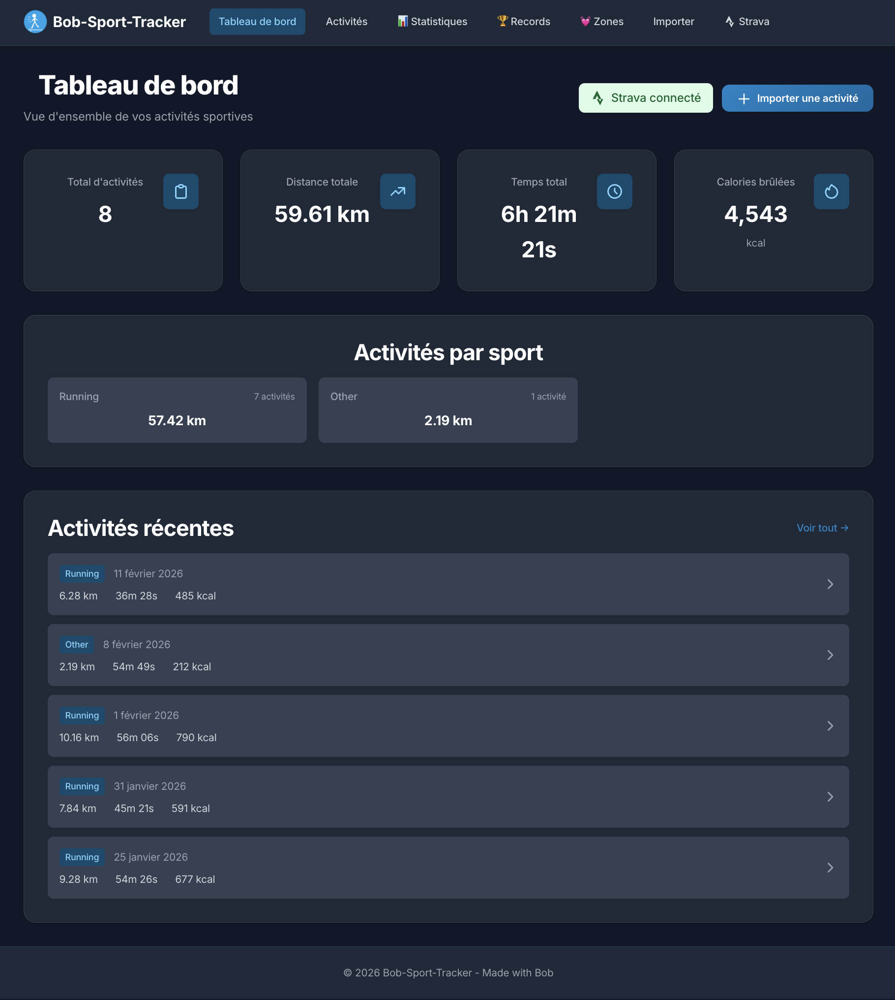
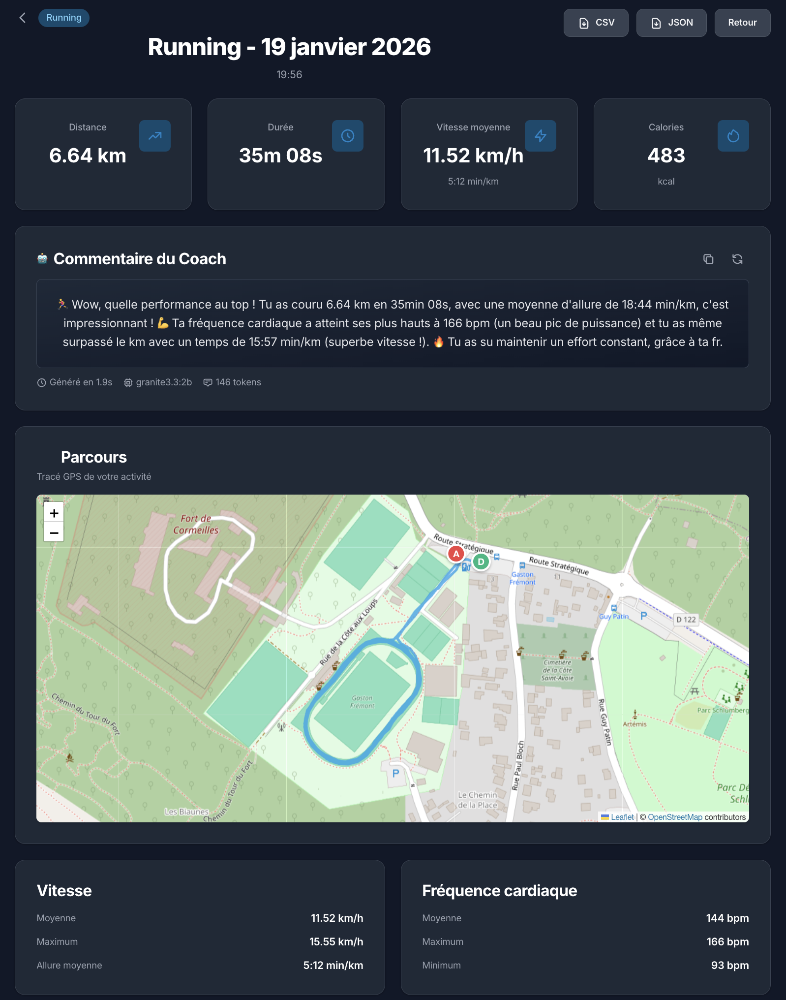
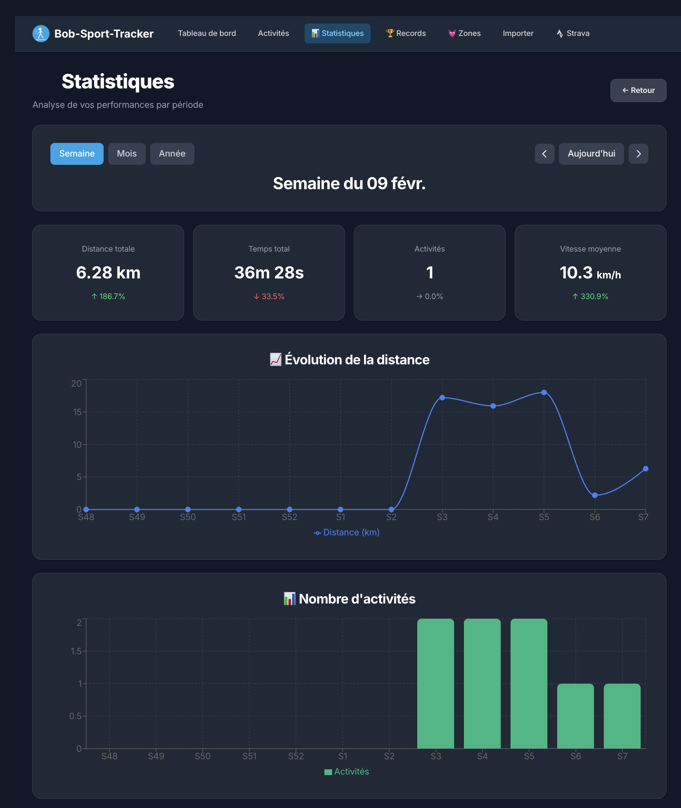

# 🏃 Bob-Sport-Tracker

Une application web moderne pour suivre et analyser vos activités sportives à partir de fichiers TCX.

## 🎨 Thèmes
- **Mode clair** et **mode sombre** avec basculement facile
- Préférence système détectée automatiquement
- Thème sauvegardé dans le navigateur

## ✨ Fonctionnalités

### 🔗 Intégration Strava (NOUVEAU !)
- **Synchronisation automatique** avec votre compte Strava
- Import de toutes vos activités en un clic
- Authentification OAuth2 sécurisée
- Détection automatique des nouvelles activités
- Synchronisation des données GPS, fréquence cardiaque, cadence, etc.
- [📖 Guide complet d'intégration Strava](STRAVA_INTEGRATION.md)

### 📊 Tableau de bord
- Vue d'ensemble de toutes vos activités
- Statistiques globales (distance totale, temps, calories)
- Répartition par sport
- Activités récentes
- Badge de statut Strava avec indicateur de nouvelles activités

### 📝 Gestion des activités
- Import de fichiers TCX (Garmin, Strava, etc.)
- **Synchronisation Strava** automatique
- Liste complète avec filtres avancés
- Détection automatique des doublons
- Suppression d'activités

### 📈 Analyse détaillée
- **Carte interactive** : Visualisation du parcours GPS avec marqueurs de départ/arrivée
- **Graphiques dynamiques** :
  - Vitesse en temps réel
  - Fréquence cardiaque
  - Altitude et dénivelé
  - Cadence
- **Statistiques complètes** :
  - Distance, durée, vitesse moyenne/max
  - Fréquence cardiaque moyenne/min/max
  - Dénivelé positif/négatif
  - Calories brûlées
  - Allure (min/km)

### 💾 Export de données
- Export CSV avec toutes les données
- Export JSON pour sauvegarde complète
- Copie du résumé dans le presse-papiers

## 📸 Captures d'écran

### Tableau de bord

*Vue d'ensemble de vos activités avec statistiques globales, répartition par sport et activités récentes*

### Détail d'une activité

*Analyse complète avec carte GPS interactive, graphiques de performance et statistiques détaillées*

### Import d'activités

*Interface d'import par glisser-déposer pour vos fichiers TCX et synchronisation Strava*

### Statistiques avancées

*Analyse approfondie de vos performances avec graphiques et métriques détaillées*

## 🚀 Technologies utilisées

- **React 19** avec TypeScript
- **Vite** pour le build ultra-rapide
- **React Router** pour la navigation
- **Tailwind CSS** pour le design moderne
- **Recharts** pour les graphiques
- **Leaflet** pour les cartes interactives
- **Dexie.js** pour le stockage local (IndexedDB)
- **date-fns** pour la gestion des dates

## 📦 Installation

```bash
# Cloner le projet
git clone <repository-url>
cd bob-sport-tracker

# Installer les dépendances
npm install

# Lancer en mode développement
npm run dev

# Build pour la production
npm run build

# Prévisualiser le build
npm run preview
```

## 🎯 Utilisation

### 1. Importer une activité

1. Cliquez sur "Importer une activité" ou allez dans l'onglet "Importer"
2. Glissez-déposez votre fichier TCX ou cliquez pour le sélectionner
3. L'activité est automatiquement analysée et enregistrée

### 2. Obtenir des fichiers TCX

#### Garmin Connect
1. Connectez-vous à Garmin Connect
2. Sélectionnez une activité
3. Cliquez sur l'icône d'engrenage (⚙️)
4. Choisissez "Exporter au format TCX"

#### Strava
1. Ouvrez une activité sur Strava
2. Cliquez sur les trois points (⋯) en haut à droite
3. Sélectionnez "Exporter TCX"

#### Autres applications
La plupart des applications sportives (Polar Flow, Suunto, etc.) permettent d'exporter au format TCX dans les paramètres d'export.

### 3. Analyser vos données

- **Tableau de bord** : Vue d'ensemble de vos performances
- **Liste des activités** : Filtrez par sport, date, distance
- **Détails** : Cliquez sur une activité pour voir tous les détails

### 4. Exporter vos données

Dans la page de détails d'une activité :
- **CSV** : Pour analyse dans Excel/Google Sheets
- **JSON** : Pour sauvegarde complète ou import ultérieur

## 🗂️ Structure du projet

```
bob-sport-tracker/
├── src/
│   ├── components/
│   │   ├── activity/        # Composants liés aux activités
│   │   │   └── FileUpload.tsx
│   │   ├── charts/          # Graphiques
│   │   │   └── ActivityChart.tsx
│   │   ├── map/             # Carte interactive
│   │   │   └── ActivityMap.tsx
│   │   └── ui/              # Composants UI réutilisables
│   │       ├── Layout.tsx
│   │       ├── Card.tsx
│   │       ├── Loading.tsx
│   │       └── Alert.tsx
│   ├── contexts/            # Contextes React
│   │   └── ThemeContext.tsx # Gestion du thème clair/sombre
│   ├── hooks/               # Hooks personnalisés
│   │   └── useActivities.ts
│   ├── pages/               # Pages de l'application
│   │   ├── Dashboard.tsx
│   │   ├── ActivitiesList.tsx
│   │   ├── ActivityDetail.tsx
│   │   └── UploadPage.tsx
│   ├── services/            # Services métier
│   │   ├── database.ts      # Gestion IndexedDB
│   │   ├── tcxParser.ts     # Parsing TCX
│   │   └── exportService.ts # Export de données
│   ├── types/               # Types TypeScript
│   │   └── activity.ts
│   ├── utils/               # Utilitaires
│   │   └── statistics.ts
│   ├── App.tsx
│   └── main.tsx
├── public/
│   └── sport-icon.svg       # Icône de l'application
├── package.json
└── README.md
```

## 🎨 Fonctionnalités techniques

### Stockage local
- Utilisation d'IndexedDB via Dexie.js
- Données persistantes dans le navigateur
- Pas besoin de serveur backend

### Performance
- Chargement lazy des composants
- Optimisation des rendus React
- Build optimisé avec Vite

### Responsive Design
- Interface adaptative mobile/tablette/desktop
- **Mode clair/sombre** avec basculement manuel et détection automatique
- Accessibilité WCAG

## 🔧 Configuration

### Tailwind CSS
Le projet utilise Tailwind CSS v4 avec une configuration personnalisée :
- Couleurs primaires et secondaires
- Classes utilitaires personnalisées
- Mode sombre intégré

### TypeScript
Configuration stricte pour une meilleure qualité de code :
- Types stricts activés
- Vérification exhaustive
- Imports de types explicites

## 📝 Format TCX

Le format TCX (Training Center XML) contient :
- Informations générales (sport, date, durée)
- Laps (tours) avec statistiques
- Trackpoints avec :
  - Position GPS (latitude/longitude)
  - Altitude
  - Fréquence cardiaque
  - Cadence
  - Vitesse
  - Distance cumulée

## 🤝 Contribution

Les contributions sont les bienvenues ! N'hésitez pas à :
- Signaler des bugs
- Proposer de nouvelles fonctionnalités
- Améliorer la documentation
- Soumettre des pull requests

## 📄 Licence

Ce projet est sous licence MIT.

## 👨‍💻 Auteur

Made with ❤️ by Bob

---

## 🚀 Prochaines fonctionnalités

- [ ] Support des fichiers GPX et FIT
- [ ] Comparaison d'activités
- [ ] Objectifs et défis personnalisés
- [ ] Statistiques par période (semaine, mois, année)
- [ ] Export PDF avec graphiques
- [ ] Partage d'activités
- [ ] Synchronisation cloud (optionnelle)
- [ ] Application mobile (PWA)

## 🐛 Problèmes connus

Aucun problème connu pour le moment. Si vous en rencontrez, merci de créer une issue.

## 📞 Support

Pour toute question ou problème :
- Créez une issue sur GitHub
- Consultez la documentation
- Vérifiez les exemples de fichiers TCX

---

**Note** : Cette application fonctionne entièrement dans votre navigateur. Vos données restent privées et ne sont jamais envoyées à un serveur externe.
